# Facial Prior Guided Micro-Expression Generation
Implementation of *FOMM with AWP* and *MRAA with AWP* in [Facial Prior Guided Micro-Expression Generation](https://ieeexplore.ieee.org/document/10375342) (IEEE TIP 2024).

## 0. Table of Contents

* [0. Table of Contents](#0-table-of-contents)

* [1. Visualizations](#1-visualizations)

* [2. Run the Code](#2-run-the-code)

* [3. Citation](#3-citation)


## 1. Visualizations

| CASE  |                            Driving                            |                             FOMM                             |                             FOMM w/ EWP                             |                            FOMM w/ AWP                             |                            MRAA                             |                            MRAA w/ AWP                             |
| :--: | :----------------------------------------------------------: | :----------------------------------------------------------: | :----------------------------------------------------------: | :----------------------------------------------------------: | :----------------------------------------------------------: | :----------------------------------------------------------: |
|  1   |    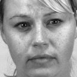    | 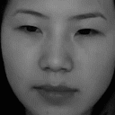  |   | 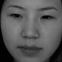 | 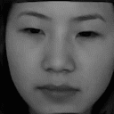 | 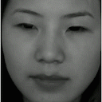 |
|  2   |       |  | 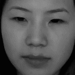 |  | 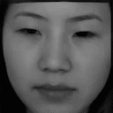 | 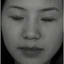 |
|  3   | 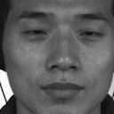 |  |  |  | 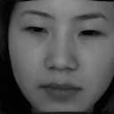 | 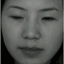 |
|  4   | 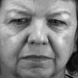 | 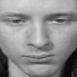 | 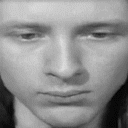 |  | 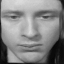 | 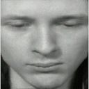 |
|  5   | 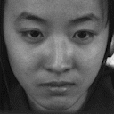 | 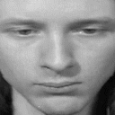 |  |  | 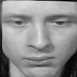 | 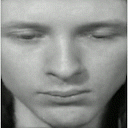 |

- To facilitate micro-expression observations and reduce the storage space of this repository, all Gifs have been slowed down and compressed.
- Case 1-3: Positive. Case 4: Negative. Case 5: Surprise.


## 2. Run the Code

1. Procedures of running *FOMM_with_AWP* and *MRAA_with_AWP* are the same.

2. Prepare your dataset. CASME2, SAMM, and SMIC-HS are recommended. See related preparation instructions in [this repository](https://github.com/Necolizer/Facial-Prior-Based-FOMM).

   - Divide into `your_dataset/train` and `your_dataset/test`

   - Create or modify `yaml` format file `your_dataset_train.yaml` in `./config`

3. Train

   ```shell
   python run.py --config config/your_dataset_train.yaml
   ```

   Log, parameters and checkpoints would be saved in `./log`

4. Test

   Create or modify `csv` format file `your_dataset_test.csv` in `./data`
   
   ```shell
   python run.py --config config/my_dataset_test.yaml --mode animate --checkpoint path/to/checkpoint
   ```
   
   Generated videos would be saved in `path/to/checkpoint/animation`

## 3. Citation

If you find this work helpful in your research, please consider citing:

```
@ARTICLE{zhang2024tipfacial,
   author={Zhang, Yi and Xu, Xinhua and Zhao, Youjun and Wen, Yuhang and Tang, Zixuan and Liu, Mengyuan},
   journal={IEEE Transactions on Image Processing}, 
   title={Facial Prior Guided Micro-Expression Generation}, 
   year={2024},
   volume={33},
   number={},
   pages={525-540},
   doi={10.1109/TIP.2023.3345177}
}

@inproceedings{zhang2021acmmmfacial,
   author = {Zhang, Yi and Zhao, Youjun and Wen, Yuhang and Tang, Zixuan and Xu, Xinhua and Liu, Mengyuan},
   title = {Facial Prior Based First Order Motion Model for Micro-expression Generation},
   year = {2021},
   booktitle = {Proceedings of the 29th ACM International Conference on Multimedia},
   pages = {4755–4759},
   numpages = {5},
   series = {MM '21},
   doi = {10.1145/3474085.3479211}
}
```